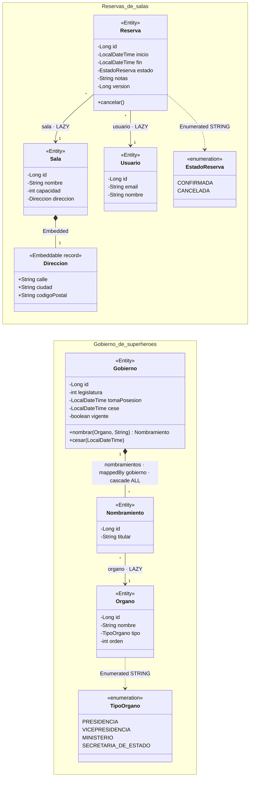

# Módulo 3 · Persistencia con Spring Data JPA

**Objetivo:** modelar la persistencia de las reservas, escribir consultas de distintos tipos, gestionar el esquema con Flyway, aplicar reglas transaccionales y detectar problemas de rendimiento.

```bash
./mvnw -pl m3-persistencia test                        # H2 + (si hay Docker) PostgreSQL con Testcontainers
docker compose -f m3-persistencia/compose.yaml up -d
./mvnw -pl m3-persistencia spring-boot:run -Dspring-boot.run.profiles=postgres
```

## Modelo

El módulo tiene dos dominios independientes: las **reservas de salas** (EJ 3.1 a 3.6) y el **gobierno de
superhéroes** del ejemplo de transacciones (EJ 3.7). Son las entidades JPA de los paquetes `dominio` y `gobierno`:



| Qué | Dónde se ve en el diagrama |
|---|---|
| `@ManyToOne(fetch = LAZY)` **unidireccional** | `Reserva → Sala` y `Reserva → Usuario`: una reserva conoce su sala, pero la sala no tiene la lista de sus reservas |
| `@OneToMany(mappedBy = "gobierno", cascade = ALL)` **bidireccional** | `Gobierno ◆── Nombramiento`: el rombo es la composición. Los nombramientos se guardan y se borran con su gobierno, y cada nombramiento apunta a su gobierno |
| `@Embeddable` record | `Direccion`: no es una entidad ni tiene tabla propia; sus tres campos son columnas de `sala` |
| `@Enumerated(STRING)` | `EstadoReserva` y `TipoOrgano`: se guarda el nombre (`CONFIRMADA`), nunca el ordinal |
| `@Version` | `Reserva.version`: el bloqueo optimista (EJ 3.5) |
| Restricciones únicas | `sala.nombre`, `usuario.email`, `organo.nombre`, `gobierno.legislatura` y el par (`gobierno_id`, `organo_id`) de `nombramiento` |

Las tablas las crea Flyway (`V1` y `V2` para las reservas, `V3` para el gobierno), y Hibernate sólo comprueba que
coinciden con este diagrama (`ddl-auto=validate`).

## Enunciados

### EJ 3.1 · Entidades y relaciones
1. Crea `Sala`, `Usuario` y `Reserva`. Usa `@ManyToOne(fetch = LAZY)` y define el *enum* `EstadoReserva` con `@Enumerated(STRING)`.
2. Modela `Direccion` como **record** `@Embeddable` (Hibernate 6.2+).
3. Añade `@Version` a `Reserva` para el bloqueo optimista.

### EJ 3.2 · Repositorios y consultas
1. Consultas derivadas: `findByNombre`, `findByCapacidadGreaterThanEqualOrderByCapacidadAsc` y `findByDireccionCiudadIgnoreCase` (propiedad anidada).
2. `@Query` JPQL con parámetros con nombre: `existeSolape(salaId, inicio, fin, estado)`.
3. Proyección **DTO** con *constructor expression* (`OcupacionSala`) y proyección por **interfaz** con una proyección anidada (`ReservaResumen`).

*Test:* `RepositoriosTest`.

### EJ 3.3 · Búsqueda dinámica con Specifications
Implementa `ReservaSpecs` con criterios combinables (sala, ciudad, estado y rango de fechas) y la búsqueda paginada y ordenada con `JpaSpecificationExecutor`. Sólo se deben aplicar los filtros informados (`Specification.allOf`).

### EJ 3.4 · El problema N+1
1. Activa `hibernate.generate_statistics` y cuenta las sentencias que genera `findByEstado(...)` cuando después se accede a `r.getSala()`.
2. Resuélvelo con `@EntityGraph(attributePaths = {"sala", "usuario"})` y comprueba que se ejecuta **una sola** consulta.
3. *Alternativas para comentar:* `JOIN FETCH`, `@BatchSize` y `hibernate.default_batch_fetch_size`, y usar proyecciones.

*Test:* `NMasUnoTest`.

### EJ 3.5 · Esquema con Flyway y transacciones
1. `V1__esquema_inicial.sql` crea las tablas; `V2__notas_indices_y_datos.sql` añade una columna, un índice y datos de ejemplo. Hibernate sólo **valida** (`ddl-auto=validate`).
2. `ReservaService#reservar` aplica las reglas de negocio: fin posterior al inicio, sala y usuario existentes y sin solapes.
3. `reservarVarias` debe ser **todo o nada**: si falla una reserva, no se guarda ninguna.
4. `cancelar` usa *dirty checking*, sin llamar a `save`.
5. Provoca una `ObjectOptimisticLockingFailureException` con dos copias de la misma reserva.

*Test:* `ReservaServiceTest`. Fíjate en que **no** es `@Transactional`: así se observan los commits y los rollbacks reales.

### EJ 3.6 · Pruebas con PostgreSQL real
Ejecuta las migraciones y las consultas contra PostgreSQL con Testcontainers y `@ServiceConnection`. *Test:* `PostgresRepositoryTest`, que se omite si no hay Docker.

### EJ 3.7 · Transacciones con humor: la alternancia en el gobierno de superhéroes

Un gobierno tiene un titular por cada órgano: la presidencia, dos vicepresidencias, siete ministerios y dos
secretarías de Estado (catálogo en `V3__gobierno_de_superheroes.sql`). Los titulares son superhéroes con un
nombre aleatorio de **sustantivo + adjetivo**, sin concordancia: *Vengador Holístico*, *Aguja Dinámico*,
*Croqueta Termonuclear*…

Las entidades son las de la parte inferior del [diagrama del modelo](#modelo): `Gobierno`, `Nombramiento`,
`Organo` y el *enum* `TipoOrgano`.

**La alternancia** (`GobiernoService#alternancia`) cambia el gobierno entero en una sola transacción:

1. El gobierno saliente cesa (*dirty checking*, sin `save`).
2. Se guarda el gobierno entrante con la legislatura siguiente.
3. Para cada órgano, en orden protocolario: `GeneradorNombresHeroicos` propone un titular, la prensa
   (`DetectorEscandalos`) lo investiga y, si sale limpio, se le nombra.

En cada nombramiento puede estallar un escándalo, con una probabilidad configurable en `application.properties`:

| Excepción | Probabilidad por nombramiento |
|---|---|
| `CasoplonException` | `gobierno.escandalos.casoplon=0.03` |
| `CutreMasterException` | `gobierno.escandalos.cutre-master=0.02` |
| `JoyasOcultasException` | `gobierno.escandalos.joyas-ocultas=0.01` |

Con 12 órganos, la alternancia sale bien con probabilidad (1 − 0,06)¹² ≈ **47,6 %**. Si estalla un escándalo,
**se deshace todo**: no hay gobierno nuevo, el saliente sigue vigente y conserva sus titulares.

**La trampa:** las tres excepciones heredan de `EscandaloException`, que es **comprobada**. Spring sólo hace
*rollback* automático con `RuntimeException` y `Error`, así que un `@Transactional` a secas haría **commit de un
gobierno a medias**. Por eso `alternancia()` lleva `@Transactional(rollbackFor = EscandaloException.class)`.
`alternanciaSinRollbackFor()` es la versión chapucera, y está para ver qué pasa sin ese atributo.

1. Modela `Organo`, `Gobierno` y `Nombramiento`. Los nombramientos se guardan en cascada con el gobierno.
2. Escribe los repositorios: el gobierno vigente con sus nombramientos en **una sola consulta** (`@EntityGraph`),
   el histórico como proyección DTO con `count` y la trayectoria de un superhéroe como proyección por interfaz
   a partir de los alias de un JPQL.
3. Implementa `GeneradorNombresHeroicos` y `DetectorEscandalos`. El detector hace **una sola tirada** en [0, 1) y
   reparte el intervalo entre los tres escándalos, para que cada uno salga exactamente con su probabilidad.
4. Implementa la alternancia **todo o nada**.

*Tests:* `GeneradorNombresHeroicosTest` y `DetectorEscandalosTest` son unitarios; el segundo comprueba las
frecuencias con 100 000 tiradas. `GobiernoRepositoriosTest` usa `@DataJpaTest`. `GobiernoServiceTest` no es
transaccional y sustituye el detector por un mock (`@MockitoBean`) para que el escándalo estalle siempre en el
quinto nombramiento (Defensa), cuando los cuatro primeros ya se han insertado.

```bash
./mvnw -pl m3-persistencia test -Dtest='GeneradorNombresHeroicosTest,DetectorEscandalosTest,GobiernoRepositoriosTest,GobiernoServiceTest'
```

## La aplicación: menú interactivo

`spring-boot:run` abre un menú de texto (`consola/ConsolaInteractiva`) con el que se usan las reservas y el
gobierno. Cada opción indica qué repositorio o servicio llama, y así se puede seguir en el log el SQL que genera.

```bash
./mvnw -pl m3-persistencia spring-boot:run      # H2 en memoria; los datos se pierden al salir
```

| Opción | Qué hace | Qué se ve |
|---|---|---|
| 1 | Salas y usuarios | `findAll(Sort)` |
| 2 | Buscar reservas con filtros opcionales, página a página | Specifications, paginación y `@EntityGraph` en `findAll(spec, pageable)` |
| 3 | Reservas de un usuario | Consulta derivada con proyección por interfaz |
| 4 | Ocupación por sala | Proyección DTO con `group by` |
| 5 · 6 | Nueva reserva y cancelar una reserva | Reglas de negocio transaccionales, solapes y *dirty checking* (un `UPDATE` sin `save`) |
| 7 · 8 | Gobierno vigente e histórico | `@EntityGraph` sobre una colección, proyección DTO con `count` |
| 9 | **¡Alternancia!** | Con suerte, un gobierno nuevo; si no, `[ROLLBACK]` y el gobierno de siempre |
| 10 | Alternancia chapucera | Si estalla un escándalo, `[COMMIT]` de un gobierno a medias |
| 11 | Trayectoria de un superhéroe | JPQL con `like` y proyección por interfaz |
| 12 | Ver y ajustar las probabilidades | Probabilidad de éxito de la alternancia, recalculada en caliente |
| 13 | Generar nombres de superhéroe | El generador, sin base de datos |
| 14 · 15 | Activar o desactivar las trazas de SQL y de transacciones | `LoggingSystem` cambia el nivel en caliente |

**¿Qué diferencia hay entre la alternancia 9 y la 10?** Ninguna mientras no estalle un escándalo: las dos
hacen commit del gobierno nuevo completo. La diferencia está en qué hace Spring cuando sale la excepción:

| | 9 · Todo o nada | 10 · Chapucera |
|---|---|---|
| Anotación | `@Transactional(rollbackFor = EscandaloException.class)` | `@Transactional` |
| Si estalla un escándalo | **Rollback**: la base de datos queda igual que antes | **Commit**: gobierno nuevo con los cargos nombrados hasta el escándalo y el saliente cesado |

Para no depender de la suerte, al lanzar una alternancia el menú pregunta en qué órgano quieres **filtrar un
escándalo a la prensa** (por ejemplo `5`, Defensa): estallará seguro al llegar a él. Después muestra el
recuento de filas **antes y después**, y el log dice cómo terminó de verdad la transacción (`<<< ROLLBACK` o
`<<< COMMIT a pesar del escándalo`). Esos avisos los escribe una `TransactionSynchronization` registrada en el
servicio, que se ejecuta cuando la transacción ya ha terminado. Con la traza de transacciones activa (15)
aparecen además `Initiating transaction rollback` o `Initiating transaction commit`. Otras formas de arrancar:

```bash
./mvnw -pl m3-persistencia spring-boot:run -Dspring-boot.run.arguments=--gobierno.semilla=42      # azar reproducible
./mvnw -pl m3-persistencia spring-boot:run -Dspring-boot.run.arguments=--m3.consola.activa=false  # sin menú: arranca y termina
```

Los tests desactivan el menú en `src/test/resources/config/application.properties`. Si no, los `@SpringBootTest`
se quedarían esperando a que alguien tecleara.

## Extra Spring Boot 4
- Hibernate 7 / JPA 3.2: prueba `EntityManagerFactory#runInTransaction`/`callInTransaction` y `@EnumeratedValue` para guardar un código en lugar del nombre del *enum*.
- Starters nuevos: `spring-boot-starter-flyway` para Flyway y `spring-boot-starter-data-jpa-test` para los tests.
- Revisa las deprecaciones de Spring Data 2025.1, por ejemplo `Specification.where(..)`. Este proyecto ya usa `Specification.allOf(..)`.
