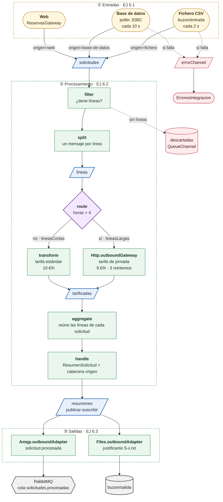

# Módulo 6 · Spring Integration

**Objetivo:** construir con el **DSL Java** un flujo de integración que recibe solicitudes de reserva por **tres entradas** (web, base de datos y ficheros CSV), las procesa con las mismas reglas aplicando patrones EIP y entrega el resultado por **dos salidas** (RabbitMQ y un justificante en fichero).

**La historia:** las solicitudes llegan desde la **web**, desde el **sistema antiguo** (que las deja en la tabla `linea_pendiente`) y desde **recepción** (que exporta una hoja de cálculo como CSV a una carpeta). Todas pasan por el mismo procesamiento: se descartan las vacías, se tarifica cada línea (las de más de 4 h, con el servicio de tarifas externo) y se calcula el total. El resumen se publica en RabbitMQ para el resto de servicios y se deja como justificante de texto en otra carpeta para administración.

```bash
docker compose -f m6-integration/compose.yaml up -d      # RabbitMQ 4.1 + consola en :15672 (guest/guest)
./mvnw -pl m6-integration spring-boot:run
```

| Para... | Haz esto |
|---|---|
| Entrada **web** | Swagger UI: <http://localhost:8080/swagger-ui.html> → `POST /api/solicitudes` (ejemplos `S-1` y `S-VACIA` ya rellenos) |
| Entrada **base de datos** | Nada: al arrancar, el *poller* procesa las solicitudes `S-100` y `S-101` de [`data.sql`](src/main/resources/data.sql) |
| Entrada **fichero** | `cp m6-integration/ejemplos/solicitudes.csv m6-integration/buzon/entrada/` |
| Ver las solicitudes **descartadas** | Swagger UI → `GET /api/solicitudes/descartadas` |
| Ver la salida **RabbitMQ** | <http://localhost:15672> → *Queues* → `solicitudes.procesadas` → *Get messages* |
| Ver la salida **fichero** | `m6-integration/buzon/salida/S-*.txt` |
| Provocar un error en un *poller* | `cp m6-integration/ejemplos/erronea.csv m6-integration/buzon/entrada/` y mira el log |

Desde la terminal, la entrada web también se puede usar con `curl`:

```bash
curl -X POST localhost:8080/api/solicitudes -H 'Content-Type: application/json' -d '{
  "id":"S-1","lineas":[
    {"sala":"Turing","fecha":"2030-03-01","horas":2},
    {"sala":"Hopper","fecha":"2030-03-01","horas":6}]}'
```

Los buzones (`buzon/entrada` y `buzon/salida`) se crean solos dentro del módulo al arrancar; sus rutas se configuran con `atech.ficheros.entrada` y `atech.ficheros.salida`.

## Flujo



Cada entrada pone la cabecera `origen` (`web`, `base-de-datos` o `fichero`), que viaja con el mensaje por todo el flujo y se lee al construir el `ResumenSolicitud`.

Formato del CSV ([`ejemplos/solicitudes.csv`](ejemplos/solicitudes.csv)): una cabecera y una fila por línea de reserva.

```csv
solicitud,sala,fecha,horas
S-200,Turing,2030-03-05,3
S-200,Hopper,2030-03-05,8
S-201,Lovelace,2030-03-06,1
```

## Enunciados

### EJ 6.1 · Entradas
1. `ReservasGateway` (`@MessagingGateway` con la cabecera `origen=web`) usada desde `SolicitudController`: el controlador no sabe nada de mensajería. Se prueba desde Swagger UI.
2. `JdbcPollingChannelAdapter` que cada 10 s lee `linea_pendiente` con estado `PENDIENTE`, marca las filas como procesadas (`updateSql`) y agrupa las líneas por solicitud.
3. `Files.inboundAdapter` que cada 2 s busca ficheros `*.csv` en el buzón de entrada, los lee y los borra (`Files.toStringTransformer(..., true)`) y convierte sus filas en solicitudes. Compáralo con el anterior: es el mismo flujo con otro origen.

### EJ 6.2 · Procesamiento (patrones EIP)
- **Filter**: descarta las solicitudes sin líneas y las envía al canal `descartadas` (un `QueueChannel` que se consulta con `GET /api/solicitudes/descartadas`).
- **Splitter**: divide cada solicitud en sus líneas.
- **Router** por contenido: separa las líneas cortas (tarifa estándar, 10 €/h) de las de jornada, de más de 4 horas (servicio de tarifas, 9 €/h).
- **Aggregator**: reúne las líneas de cada solicitud usando las cabeceras de secuencia que añade el *splitter*; un `handle` calcula el total y lee la cabecera `origen`.

### EJ 6.3 · Salidas
- `Http.outboundGateway` hacia el servicio de tarifas (simulado en `TarifasController`).
- Canal **publicar-suscribir** `resumenes` con dos suscriptores:
  - `Amqp.outboundAdapter` al exchange `reservas.exchange` con la *routing key* `solicitud.procesada` (la aplicación declara la cola `solicitudes.procesadas` para verlo en la consola).
  - `Files.outboundAdapter` que escribe un justificante `<solicitud>.txt` en el buzón de salida. *Para pensar:* ¿por qué hay que **sobrescribir** la cabecera `file_name` antes de escribir?

### EJ 6.4 · Robustez
- `RequestHandlerRetryAdvice` con *backoff* exponencial en la llamada HTTP.
- Un suscriptor adicional del `errorChannel` global (`ErroresIntegracion`). *Para pensar:* ¿por qué el error de un CSV mal formado llega al `errorChannel` y el de una solicitud web no (la web recibe un 500)?

### EJ 6.5 · Pruebas
`FlujosReservasTest` usa `@SpringIntegrationTest` y `MockIntegrationContext` para sustituir los extremos HTTP y AMQP por *mocks* (`MockIntegration.mockMessageHandler`). Los ficheros no se simulan: los buzones apuntan a `target/test-buzon`. Los dos *pollers* (JDBC y ficheros) no arrancan automáticamente (`noAutoStartup`) y cada test arranca el suyo cuando lo necesita. `SwaggerUiTest` comprueba el contrato OpenAPI con la pasarela simulada.

## Extra Spring Boot 4 / Spring Integration 7
- Compila con `-Xlint:deprecation` para revisar las deprecaciones del DSL, y adapta los *advices* de reintento a la nueva API de reintentos de Spring Framework 7 (`org.springframework.core.retry`).
- Observabilidad: activa `spring.integration.management.observation-patterns=*` y consulta las trazas.
- Genera el grafo del flujo con Actuator (`/actuator/integrationgraph`).
- Robustece el buzón de entrada: mueve los ficheros a `procesados/` o `errores/` en lugar de borrarlos.
